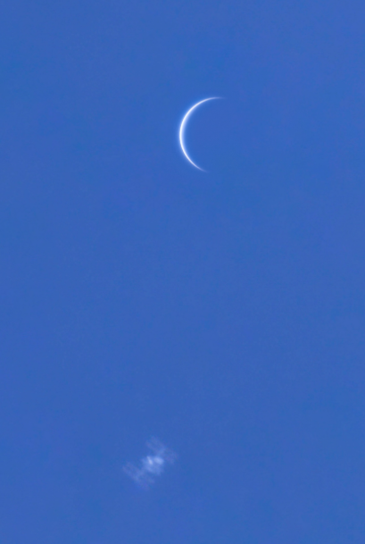

# NASA-APOD

## A Python program to view NASA's Astronomoy Picture of the Day

This is a Python program to view NASA's APOD using the APOD API.
The project was a good chance to practise working with APIs and 
learning how to store API keys securely using environment variables.

## Demo

## Instructions

Clone the git repo and run main.py. You will also need to obtain an
api key for NASA's open APIs and then created a .env file in the 
project directory and add your API key.  